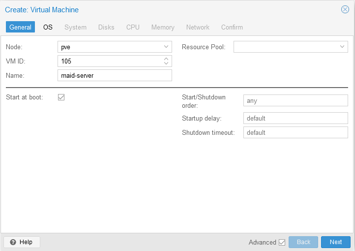
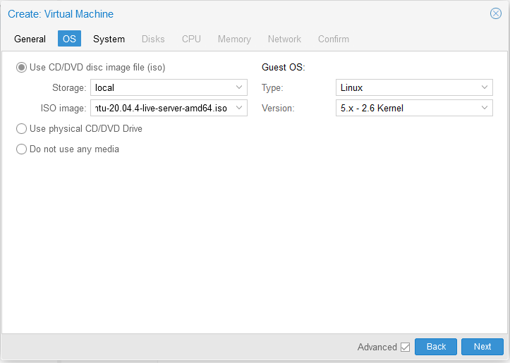
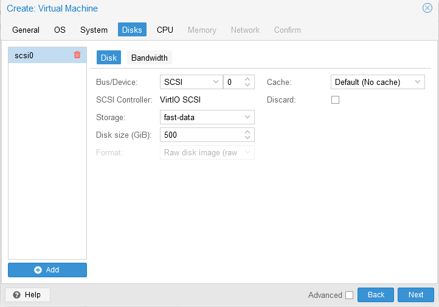
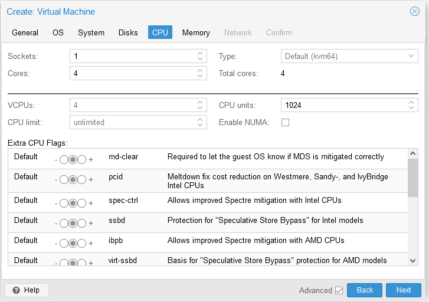
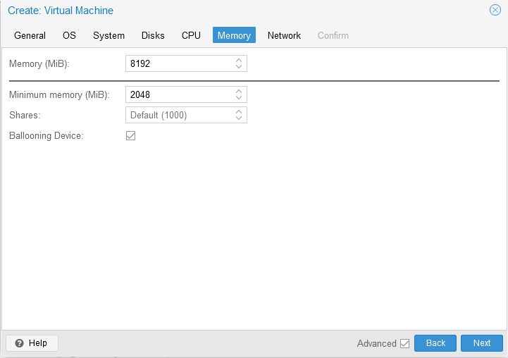
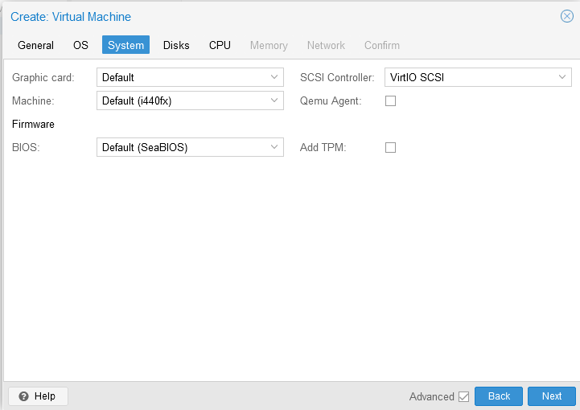
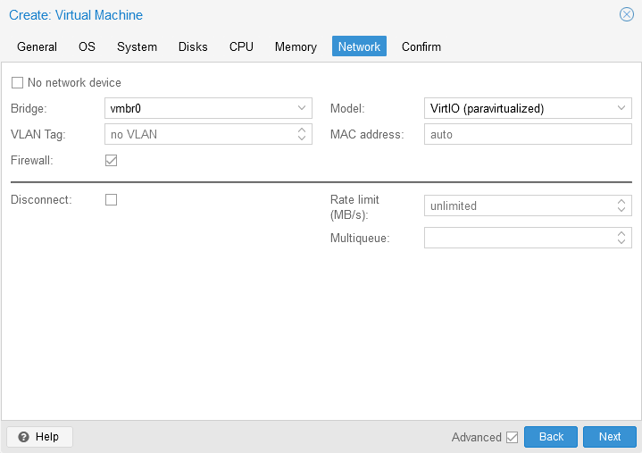
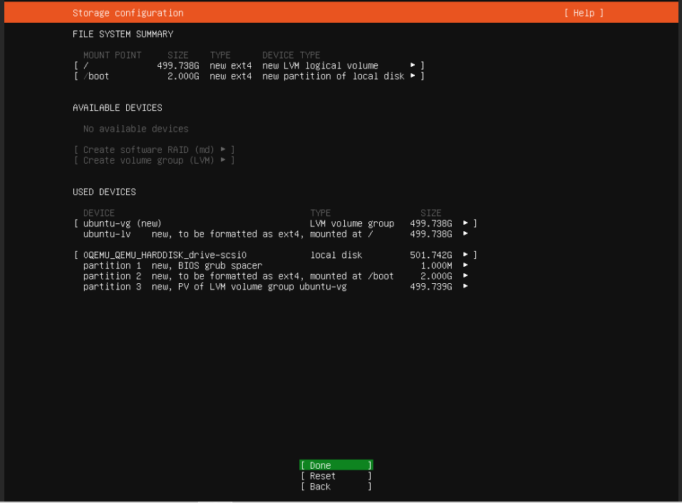

# Setting up MAID VM

## Install Proxmox on the server

## Create a LVM Thin Pool on the hard drive

## Create a new VM

Settings are as follows:

## Install Ubuntu

* Use the following partitioning:

* Install docker if prompted.
* Check that the IP address is `192.168.123.4`

## Setup Ubuntu

### Configure SSH

* To recreate possible offending keys run `ssh-keygen -R 192.168.123.4` on the client side
* Upload your public key:
  * In Windows PowerShell ([source](https://www.chrisjhart.com/Windows-10-ssh-copy-id/)): `type $env:USERPROFILE\.ssh\id_rsa.pub | ssh gain@192.168.123.4 "cat >> .ssh/authorized_keys"`
  * Under Linux use `copy-id`

### Install portainer

Follow the [official guide](https://docs.portainer.io/v/ce-2.9/start/install/server/docker/linux):

* `sudo docker volume create portainer_data`
* `sudo docker run -d -p 8000:8000 -p 9443:9443 --name portainer --restart=always -v /var/run/docker.sock:/var/run/docker.sock -v portainer_data:/data portainer/portainer-ce:latest`
* Open https://192.168.123.4:9443 in a browser
* Create an `admin` user